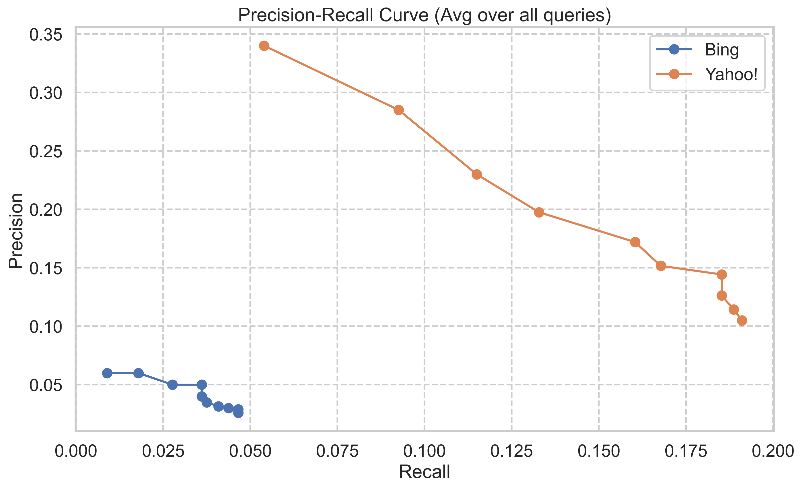
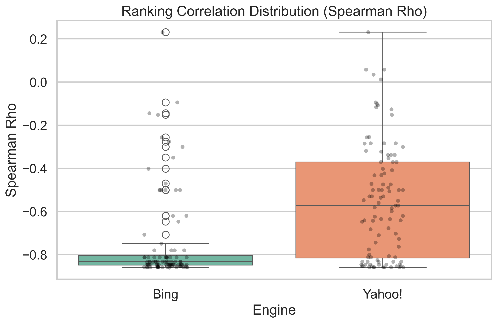
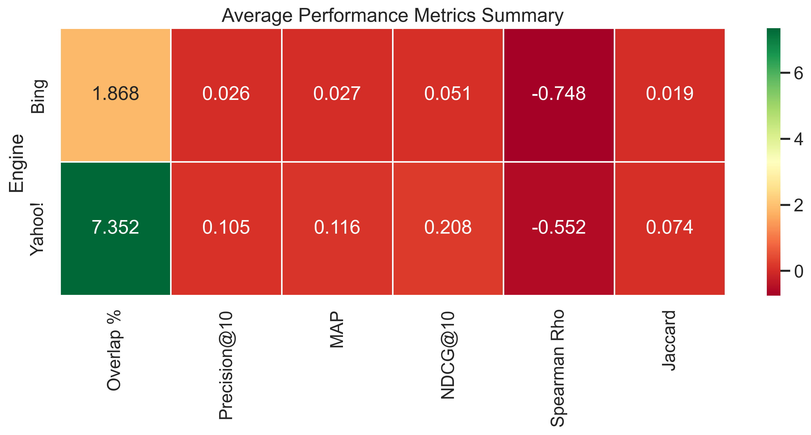

# SearchRank Analytics Engine 🔍📊


A robust, modular analytics engine designed to scrape, analyze, and evaluate search engine ranking performance across Google, Bing, and Yahoo. This tool automates the collection of SERP data and provides a comprehensive suite of metrics to assess the similarity and quality of search results.

## 🚀 Features

- **Multi-Engine Scraping**: Seamlessly scrape search results from Google, Bing, and Yahoo.
- **Advanced Metrics**: Compute Precision@k, Recall@k, MAP, NDCG, and Spearman Correlation.
- **Robust Evaluation**: Built-in Bootstrap Confidence Intervals and 5-Fold Cross-Validation for statistical significance.
- **Visualizations**: Generate publication-ready plots (Heatmaps, Precision-Recall Curves, Boxplots).
- **Resilient Architecture**: Handles detailed scraping logic including Bing redirect decoding and user-agent rotation.

## 📂 Project Structure

```bash
SearchRank Analytics Engine/
├── config/              # Centralized configuration (YAML)
├── data/                # Data storage (queries, raw results)
├── src/                 # Source code module
│   ├── scraper/         # Search engine interfaces (Base, Google, Bing, Yahoo)
│   ├── metrics/         # Statistical & ranking metrics implementation
│   ├── evaluation/      # Evaluation orchestration (Bootstrap, CV)
│   ├── visualization/   # Plotting modules using Seaborn/Matplotlib
│   └── utils/           # IO and Normalization utilities
├── experiments/         # Experiment runners
└── output/              # Generated artifacts (JSON results, CSV metrics, Plots)
```

## 🛠️ Installation

1.  **Clone the repository**:
    ```bash
    git clone https://github.com/yourusername/searchrank-analytics.git
    cd searchrank-analytics
    ```

2.  **Install dependencies**:
    ```bash
    pip install -r requirements.txt
    pip install -e .
    ```

## ⚡ Usage

### 1. Scrape Search Results
Run the scraper to collect data from all configured engines.
```bash
python experiments/experiment_runner.py --task scrape --limit 10
```
- **Limit**: Optional flag to limit results per query.
- **Output**: Saved to `output/task1/<timestamp>/`.

### 2. Evaluate Performance
Analyze the scraped data against the ground truth (Google).
```bash
python experiments/experiment_runner.py --task evaluate
```
- **Input**: Automatically detects the latest results in `output/task1/`.
- **Output**: Generates `evaluation_final.csv` and visualizations in `output/task2/`.

## ⚙️ Configuration

Modify `config/experiment.yaml` to adjust:
- **Search Queries**: Path to query file.
- **Scraping Delays**: Min/Max delay between requests to avoid rate limits.
- **Browser Settings**: Headless mode, User-Agent strings.

## 📊 Outputs

- **`evaluation_final.csv`**: Detailed metrics for every query/engine pair.
- **Visualizations**:
  
  **Precision-Recall Curve**
  

  **Ranking Correlation Distribution**
  

  **Metrics Heatmap**
  

## 🤝 Contributing

Contributions are welcome! Please fork the repository and submit a pull request.

## 📄 License

Distributed under the MIT License. See `LICENSE` for more information.# SearchRank-Analytics-Engine
